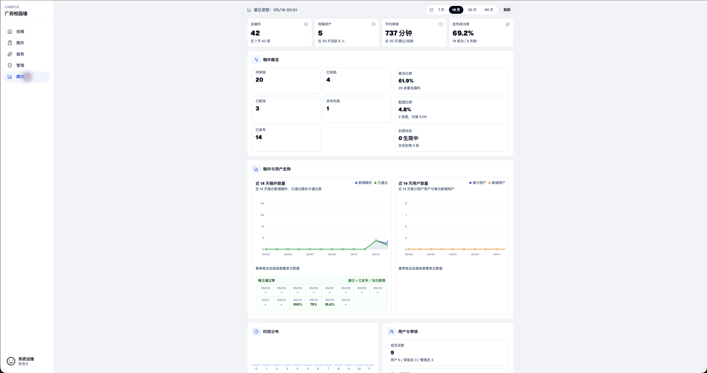

<p align="center">
  
</p>

<h1 align="center">Campux</h1>

<p align="center">开源校园墙运营系统 · 投稿、审核、QQ 机器人、QZone 发布、统计、多租户，一套自托管 TypeScript 应用。</p>



## 适合谁

主要面向**校园墙运营管理员**：自助开墙、配置机器人和发布目标、审核投稿、管理成员/公告/规则/封禁、查看统计。

- 审核员、投稿用户：在产品内按角色使用，无需阅读文档。
- 自托管系统维护者：部署、多租户生命周期、全局账号、域名与安全，见[系统维护手册](https://docs.campux.top/admin/overview)。

## 开始使用

官方服务入口 `https://app.campux.top`。从该域名访问即可用邮箱验证码注册**运营管理员**账号，然后在产品内：

1. 创建自己的校园墙
2. 添加墙号 Bot，复制 OneBot URL 到 NapCat 反向 WebSocket
3. 配置审核群、发布目标和 QZone cookies
4. 测试投稿 → 审核 → 发布闭环

完整步骤见 [自助开墙流程](https://docs.campux.top/operator/self-service-onboarding)。普通用户通过对应校园墙机器人注册，不走此入口。

## 功能

- **投稿到发布闭环**：网页/私聊投稿 → 网页或审核群审核 → QQ 空间自动发布，失败可重试，发布日志可追溯。
- **OneBot v11 机器人接入**：墙号机器人私聊注册、重置密码、审核群命令、扫码登录、cookies 健康检查。
- **两种部署模式**：自用单墙（隐藏多租户，开箱即用）或多租户运营平台（多个运营者自助开墙）。
- **引导式初始化**：全新实例首次打开走「初始化向导」创建管理员，无需手动改库。
- **统计看板**：稿件量、好友量、空间互动数据采集与展示。
- **自托管友好**：PostgreSQL + S3/MinIO + Docker Compose + 启动自动迁移。

## 匿名遥测

自托管实例默认每 6 小时向 [dash.campux.top](https://dash.campux.top) 上报匿名聚合统计（实例数、版本、稿件/用户计数），**不含任何用户内容、域名或身份信息**，用于了解版本分布与维护优先级，全网汇总数据公开可见。设置 `CAMPUX_TELEMETRY_DISABLED=true` 即可完全关闭，字段明细与隐私边界见[遥测说明](https://docs.campux.top/admin/telemetry)。

## 文档

完整文档见 **[docs.campux.top](https://docs.campux.top)**。

- 运营管理员：[自助开墙](https://docs.campux.top/operator/self-service-onboarding) · [运营手册](https://docs.campux.top/operator/overview) · [OneBot 接入](https://docs.campux.top/reference/onebot) · [配置参考](https://docs.campux.top/reference/configuration)
- 系统维护者：[部署与快速开始](https://docs.campux.top/getting-started) · [系统维护手册](https://docs.campux.top/admin/overview) · [故障排查](https://docs.campux.top/admin/troubleshooting)

## 自托管部署

<details>
<summary>Docker Compose 一键启动与部署注意事项</summary>

生产或演示环境直接用 Docker Compose：

```bash
cp .env.example .env
# 必填：生成并写入 Bot session 密钥，否则容器拒绝启动
echo "CAMPUX_BOT_SESSION_SECRET=$(openssl rand -hex 32)" >> .env
docker compose up -d
```

默认地址：Web 与 API `:8989`、PostgreSQL `:5432`、MinIO API `:9000`、MinIO Console `:9001`。

**首次打开会进入初始化向导**：选择部署模式（自用单墙 / 多租户）、创建第一个管理员账号，无需手动改数据库。详见 [部署与快速开始](https://docs.campux.top/getting-started)。

部署注意事项：

- 生产环境必须设置 `CAMPUX_BOT_SESSION_SECRET`，用于加密机器人 cookies。
- 生产环境请使用 HTTPS，session cookie 在 `NODE_ENV=production` 下会带 `Secure`。
- 应用启动默认执行 Prisma migration，跳过可设 `CAMPUX_SKIP_AUTO_MIGRATE=true`。
- QZone 发布依赖有效 cookies，建议配置 cookies 健康检查和可人工介入的扫码登录。

</details>

## 参与开发

<details>
<summary>本地开发环境（只起基础设施，前后端分别启动）</summary>

```bash
docker compose -f docker-compose.dev.yaml up -d
bun install
bun run db:generate
bun run db:migrate
bun run db:seed
bun run dev:server
bun run dev:web
```

开发前端默认 `:5180`，后端默认 `:8989`。`bun run db:seed` 会植入测试账号（密码均为 `campux123`），详见 [本地开发](https://docs.campux.top/contributing/local-development)。

</details>

## 技术栈

Bun workspace · Vite + React · Fastify · Prisma + PostgreSQL · S3 兼容存储 · OneBot v11 WebSocket · Docker · VitePress

## 许可证

[Apache License 2.0](./LICENSE)
