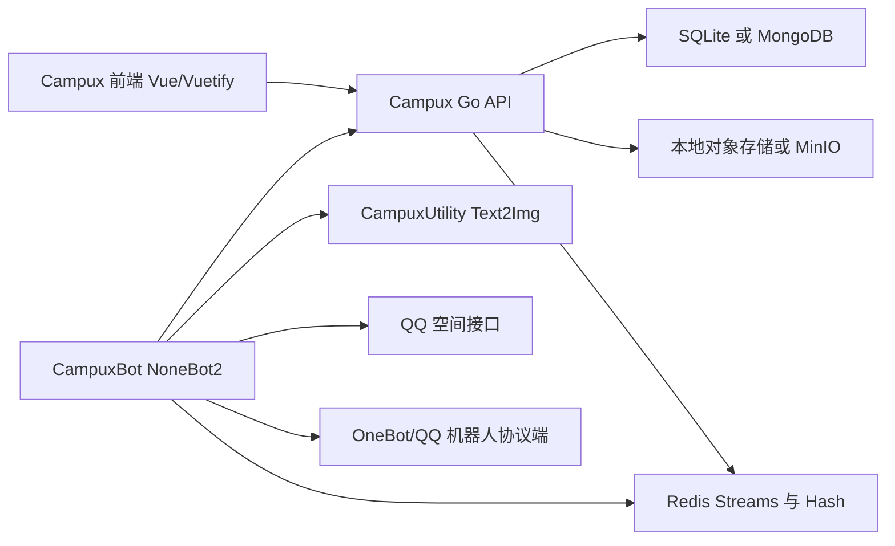

# 现状架构分析

## 总览

当前 Campux 是一个由三个进程组成的微服务式系统：

核心领域在 `Campux/`，Bot 和 Utility 是围绕投稿审核与发布流程拆出去的两个辅助服务。现在的问题不是“服务太多”本身，而是服务边界里混入了大量全局状态：一个实例默认只服务一个校园墙，扩展到多个学校时只能复制整套容器、配置和数据目录。

## Campux

### 技术栈

- 后端：Go 1.22、Gin、Gorm、Viper、gocron。
- 数据库：SQLite 或 MongoDB 二选一。
- 对象存储：本地文件或 MinIO。
- 消息队列：Redis Streams + Redis Hash。
- 前端：Vue 3、Vite、Vuetify、Vuex、Vue Router。
- 部署：`docker/docker-compose.yaml` 同时编排 Redis、Campux、CampuxBot、CampuxUtility。

### 后端结构

入口在 `main.go`：

1. 创建 `data/`。
2. 读取或生成 `data/campux.yaml`。
3. 执行数据库迁移。
4. 创建 `core.Application` 并启动 Gin。

`backend/core/app.go` 负责组装运行时依赖：

- `makeDBManager()` 根据 `database.use` 选择 SQLite 或 MongoDB。
- `makeOSSProvider()` 根据 `oss.use` 选择本地存储或 MinIO。
- `mq.NewRedisStreamMQ()` 创建 Redis Stream 客户端。
- 创建 Account、Post、Misc、Admin、OAuth2 服务。
- 每 20 秒调度 `SchedulePublishing` 与 `ConfirmPosted`。

### API 模块

现有 `/v1` API 可归成五组：

| 模块 | 主要路由 | 当前职责 |
| --- | --- | --- |
| Account | `/v1/account/*` | 创建账号、登录、改密、封禁、用户组管理、账号列表 |
| Post | `/v1/post/*` | 图片上传下载、投稿、列表、审核、取消、日志、发布详情 |
| Misc | `/v1/misc/*` | 站点 metadata、版本 |
| Admin | `/v1/admin/*` | 初始化管理员、OAuth2 app 管理 |
| OAuth2 | `/v1/oauth2/*` | 授权码、access token、用户信息 |

服务鉴权使用全局 `service.token`，用户鉴权使用 JWT 和 `access-token` Cookie。权限组为 `admin`、`member`、`user`，另外有 `any` 作为查询条件。

### 数据模型

核心模型在 `backend/database/po.go`：

- `AccountPO`：QQ 号、密码哈希、用户组、创建时间。
- `BanInfo`：封禁记录。
- `PostPO`：投稿 ID、UUID、QQ 号、正文、图片 key、匿名、状态、创建时间。
- `PostLogPO`：投稿状态流转日志。
- `PostVerbose`：发布到外部平台后的补充信息，例如 QZone tid。
- `Metadata`：站点配置项，如 `brand`、`banner`、`services`、`post_rules`。
- `OAuthAppPO`：OAuth2 应用。

投稿状态机包含：

`pending_approval -> approved/rejected/cancelled -> in_queue -> published`

代码里还预留了 `failed`、`pending_recall`、`recalled`，但当前撤回流程没有完整实现。

### 异步发布流程

1. 用户在 Web 投稿，`PostService.PostNew()` 写入投稿和日志。
2. Go 服务向 Redis Stream 写入 `new_post`。
3. Bot 消费 `new_post`，向审核群发送新稿件。
4. 管理员在 Web 或群内审核，通过后状态变为 `approved`。
5. Go 定时任务扫描 `approved`，写入 `publish_post`，并把状态改为 `in_queue`。
6. Bot 消费 `publish_post`，下载投稿图片，调用 Utility 生成文本图片，发布到 QQ 空间。
7. Bot 写入 `post_log` 和 `post_verbose`，并在 Redis Hash 标记该 Bot 已发布。
8. Go 定时任务扫描 `in_queue`，当所有配置的 `service.bots` 都标记完成时，将稿件改为 `published`。

这个流程是当前系统最有价值的业务资产，应当在 CampuxNext 中保留业务语义，但不必保留 Redis Stream 作为进程间通信形态。

## CampuxBot

### 技术栈与入口

`CampuxBot/main.py` 创建 `campux.core.app.Application`，然后启动 NoneBot2。依赖包括：

- `nonebot2[fastapi]`
- `nonebot-adapter-onebot`
- `aiohttp`
- `redis`
- `requests`

配置来自 `data/config.json`，模板在 `templates/config.json`。环境变量可以覆盖同名字段。

### 机器人职责

Bot 当前承担四类职责：

1. QQ 私聊账号自助：`#注册账号`、`#重置密码`。
2. 审核群工作台：新稿件通知、取消通知、审核结果通知、`#通过`、`#拒绝`、`#重发`、`#登录`。
3. QZone 发布器：检查 cookie、登录、上传图片、发布说说。
4. Campux 服务适配器：通过 HTTP 调用 Go API，通过 Redis Streams 接收异步任务。

### 与 Campux 的耦合

Bot 不是独立业务系统，它的绝大多数方法都依赖 Campux API：

- `CampuxAPI.sign_up()` 调 `/v1/account/create`。
- `CampuxAPI.reset_password()` 调 `/v1/account/reset`。
- `CampuxAPI.get_post_info()` 调 `/v1/post/get-post-info/:id`。
- `CampuxAPI.review_post()` 调 `/v1/post/review-post`。
- `CampuxAPI.post_post_log()` 调 `/v1/post/post-log`。
- `CampuxAPI.submit_post_verbose()` 调 `/v1/post/submit-verbose`。

服务间鉴权是全局 `campux_token`，没有租户上下文。

### 全局状态

以下 Bot 配置天然是“某个校园墙实例”的配置：

- `campux_domain`
- `campux_qq_bot_uin`
- `campux_review_qq_group_id`
- `campux_text_to_image_api`
- `campux_help_message`
- `campux_review_help_message`
- `campux_qzone_cookies_refresh_strategy`
- `data/metadata.json` 中的 `post_publish_text`
- `data/cache.json` 中的 `qzone_cookies`

这些在多租户下必须变成租户级配置或 Bot 账号级配置。

## CampuxUtility

### 技术栈与职责

`CampuxUtility` 是 FastAPI + Jinja2 sandbox + Playwright 的 HTML 转图片服务：

- `POST /text2img/generate`
- `GET /text2img/data/{id}`

Bot 把投稿内容、头像、模板和渲染参数发给 Utility，Utility 生成临时图片文件并返回 ID。它每小时清理过期文件。

### 适合迁入单体的部分

Utility 没有自己的业务数据，只有渲染能力。迁到 TypeScript 单体时可以直接变成一个内部模块：

- `renderService.renderHtmlToImage()`
- `renderService.renderPostCard()`
- 后端内部使用 Playwright 或 `@playwright/test` 的 Chromium。

对外不必继续暴露 `/text2img` HTTP 服务，除非希望保留兼容接口。

## 前端现状

前端是一个偏移动端的单页应用，路由包括：

- `/`：投稿页。
- `/auth`：登录与 OAuth 授权页。
- `/world`：稿件列表、个人稿件和审核。
- `/service`：校园服务列表与改密。
- `/admin`：账号、封禁、OAuth app、metadata 管理。
- `/init`：初始化管理员。

前端通过全局 metadata 驱动品牌和站点内容，包括 `brand`、`banner`、`post_rules`、`services`、`beianhao`。这套 metadata 是多租户改造的关键入口。

## 当前边界判断

可以保留的业务边界：

- 身份与权限。
- 投稿与审核。
- 发布器任务。
- 站点配置 metadata。
- OAuth2 扩展能力。
- 图片/对象存储。
- HTML 转图。

应该移除的部署边界：

- Go API 与 Bot 之间的 HTTP service token。
- Bot 与 API 之间通过 Redis Stream 交换任务。
- Utility 作为独立 Web 服务。
- 每个学校一套容器和 data 目录。

