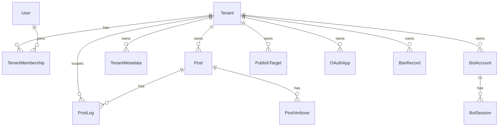
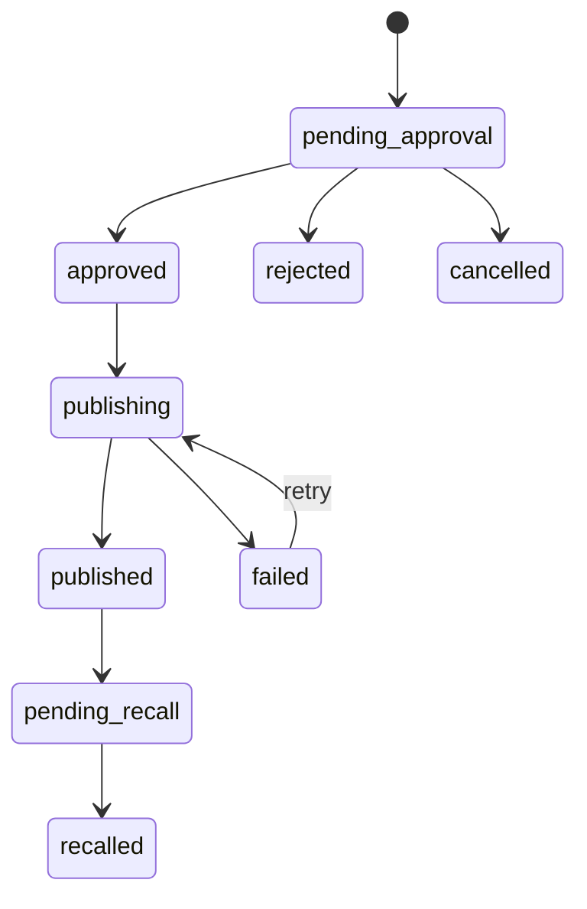

# 目标单体与多租户架构

## 目标

CampuxNext 应该是 TypeScript 全栈单体应用，同时内建多租户能力。这里的“单体”不是把所有代码写在一起，而是一个部署单元内按模块组织：

- Web UI、API、后台任务、Bot 适配器、发布器、渲染器共享同一套领域模型。
- 同一实例可管理多个学校/校园墙。
- 每个租户拥有自己的品牌、投稿规则、审核群、墙号、发布目标、OAuth 应用和运营配置。
- 运维上减少多套 Docker Compose、多份 Redis、多份配置文件带来的重复劳动。

## 建议技术形态

推荐使用 TypeScript monorepo，但运行时保持单体：

```text
CampuxNext/
  apps/
    web/              # 前端 UI
    server/           # API、后台任务、Bot runtime
  packages/
    domain/           # 领域类型、状态机、权限策略
    db/               # Prisma schema、迁移、repositories
    integrations/     # OneBot、QZone、对象存储、OAuth provider
    render/           # Playwright 渲染
    config/           # 配置加载、租户设置 schema
```

具体框架可以二选一：

1. Next.js 全栈：适合前后端一体、页面和 API 共部署，后台 worker 需要单独入口。
2. Fastify/NestJS + Vite/React 或 Vue：适合更清晰的后端模块和长期后台任务。

如果重构目标是“稳定管理多个学校”，我倾向于 `Fastify + Vite + Prisma + PostgreSQL`。Next.js 也能做，但 Bot 常驻连接、发布队列和 Playwright 渲染更像后端服务，独立 server 入口会更舒服。

数据库建议：

- 主库：PostgreSQL。
- ORM：Prisma 或 Drizzle。若更看重 schema 可读性和迁移体验，用 Prisma；若更看重 SQL 控制和轻量，用 Drizzle。
- 队列：单体内仍建议保留持久任务表，而不是只用内存队列。可以先用数据库任务表，未来再接 BullMQ/Redis。
- 对象存储：本地磁盘和 S3 兼容接口二选一，抽象保留。

## 多租户模型

### 核心实体

多租户的关键是把“墙/学校”抽象为 `Tenant`，并让所有业务数据显式归属租户。



建议的基础表：

| 表 | 说明 |
| --- | --- |
| `tenants` | 学校/校园墙，含 slug、名称、状态、默认域名或访问路径 |
| `users` | 全局用户，以 QQ uin 或其他登录身份为主体 |
| `tenant_memberships` | 用户在某租户下的角色，替代当前全局 `user_group` |
| `tenant_metadata` | 租户级站点配置，替代全局 `metadata` |
| `posts` | 投稿，增加 `tenant_id` |
| `post_logs` | 投稿日志，增加 `tenant_id` |
| `post_verbose` | 发布结果详情，增加 `tenant_id` |
| `ban_records` | 租户级封禁，增加 `tenant_id` |
| `oauth_apps` | 租户级 OAuth 应用，增加 `tenant_id` |
| `bot_accounts` | 墙号、审核群、命令配置、发布策略 |
| `bot_sessions` | QZone cookies、登录状态、过期信息，加密存储 |
| `publish_targets` | 发布目标，可先只支持 QZone，后续扩展公众号、Telegram 等 |
| `jobs` | 持久后台任务，替代 Redis Streams 的业务角色 |

### 租户隔离策略

建议采用共享数据库、每张业务表带 `tenant_id` 的模式。它最适合“不是 SaaS，但一个实例管理多个学校”的目标。

必须落实的约束：

- 所有租户级表都带 `tenant_id`。
- 查询 repository 默认要求传入 `tenantId`，不要允许业务层裸查全表。
- 唯一索引必须考虑租户维度，例如 `(tenant_id, post_id)`、`(tenant_id, key)`、`(tenant_id, client_id)`。
- `uin` 不应再直接等于账号主键。一个 QQ 用户可以在多个学校有不同角色和封禁状态。
- 管理后台需要区分“实例管理员”和“租户管理员”。

推荐角色：

| 角色 | 作用域 | 权限 |
| --- | --- | --- |
| `instance_owner` | 全局 | 创建租户、全局配置、跨租户查看 |
| `tenant_admin` | 单租户 | 租户配置、成员、OAuth app、Bot 配置 |
| `tenant_moderator` | 单租户 | 审核、封禁、查看投稿 |
| `tenant_user` | 单租户 | 投稿、查看自己的稿件 |

现有 `admin/member/user` 可以映射为 `tenant_admin/tenant_moderator/tenant_user`。

## 租户识别

Web 访问需要先定位租户。建议同时支持三种方式：

1. 域名：`gz.example.com` 解析到某租户。
2. 路径：`/t/:tenantSlug`。
3. 管理后台显式选择租户。

API 层建议使用以下上下文：

```ts
type RequestContext = {
  tenantId?: string
  userId?: string
  membership?: TenantMembership
  isInstanceOwner: boolean
}
```

前台投稿页必须有 `tenantId`；全局管理页可以没有默认租户，但进入租户管理后必须绑定。

## 投稿与发布任务

现有 Redis Stream 语义可以映射为持久任务：

| 现有事件 | 新任务类型 | 触发 |
| --- | --- | --- |
| `new_post` | `notifyNewPost` | 投稿创建成功 |
| `post_cancel` | `notifyPostCancelled` | 用户取消 |
| `post_review` | `notifyReviewResult` | 审核通过/拒绝 |
| `publish_post` | `publishPost` | 审核通过后创建，或定时扫描创建 |

建议将发布流程改为显式任务状态：



这里建议把当前的 `in_queue` 重命名或语义收敛为 `publishing`。如果为了迁移兼容可以保留数据库枚举值 `in_queue`，但领域层暴露 `publishing`。

多租户下，发布任务必须包含：

- `tenantId`
- `postId`
- `targetId`
- `botAccountId`
- `attempt`
- `status`
- `lastError`

这样一个租户可以配置多个墙号或多个发布目标，不再依赖全局 `service.bots`。

## Bot 集成目标形态

当前 Bot 的业务逻辑建议迁入 `integrations/onebot` 和 `integrations/qzone`：

- OneBot 连接管理：接入一个或多个 QQ 机器人协议端。
- 命令路由：根据群号、私聊用户、Bot 账号定位租户。
- 审核群通知：租户级配置。
- 私聊注册和重置密码：需要先判断用户要注册哪个租户。可以通过 Bot 账号所属租户或命令参数决定。
- QZone 发布器：租户级 Bot 账号和 session。

命令路由要从“一个 Bot 只有一个租户”升级为：

```text
message -> botAccountUin -> tenantBotBinding -> tenantId -> command handler
groupId -> tenant review group binding -> tenantId
```

如果一个 QQ Bot 账号服务多个学校，需要进一步支持命令参数或群绑定。但从当前运营模式看，更自然的是一个学校一个墙号或一个审核群绑定一个租户。

## 渲染服务目标形态

Utility 可以变成内部渲染模块：

- 模板存储在数据库或代码模板目录。
- 模板变量来自 `tenant_metadata`、`post`、`user`、`bot_account`。
- Playwright 浏览器实例复用，渲染结果写入对象存储或临时目录。
- 对模板执行白名单或使用安全模板引擎，避免当前 Bot 中 `eval(post_publish_text)` 这类动态执行。

当前 `post_publish_text` 支持表达式拼接，这很灵活但风险高。建议改为模板字符串，例如：

```text
#{post.id}
{links}
投稿来自 {tenant.name}
```

由代码提供 `post`、`tenant`、`links` 等安全变量。

## API 兼容策略

为了降低前端和 Bot 迁移成本，可以先保留 `/v1` 风格，但新接口必须显式带租户：

- 公共页面：`GET /api/tenants/by-host`
- Metadata：`GET /api/tenants/:tenantId/metadata`
- 投稿：`POST /api/tenants/:tenantId/posts`
- 后台：`GET /api/admin/tenants`
- Bot 内部：不再经 HTTP 调本机 API，改为调用 domain service。

若保留旧 `/v1`，应仅作为单租户兼容层：当实例只有一个租户时自动映射，或通过配置指定默认租户。

## 配置归属

需要从全局配置迁入数据库的配置：

- `brand`
- `banner`
- `popup_announcement`
- `post_rules`
- `services`
- `beianhao`
- `service.bots`
- `service.domain`
- `campux_review_qq_group_id`
- `campux_qq_bot_uin`
- `campux_help_message`
- `campux_review_help_message`
- `campux_publish_post_time_delay`
- `campux_qzone_cookies_refresh_strategy`
- `post_publish_text`

仍适合作为实例级环境变量的配置：

- 数据库连接。
- 对象存储根配置。
- 加密密钥。
- Web 监听端口。
- OneBot 连接默认参数。
- Playwright 浏览器路径或运行参数。

## 安全要点

- Bot cookies 必须加密落库，不能像现在一样以 JSON 明文缓存。
- OAuth2 app 必须按租户隔离，redirect URI 校验继续保留严格匹配。
- Service token 在单体内应消失。若还存在外部 Bot 兼容模式，也要变成租户级 token，并支持轮换。
- 投稿图片对象 key 应包含租户前缀，例如 `tenants/{tenantId}/posts/{postId}/...`。
- 所有后台任务执行前重新加载租户配置，避免配置变更后旧任务误发。

