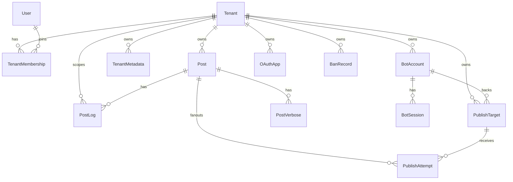
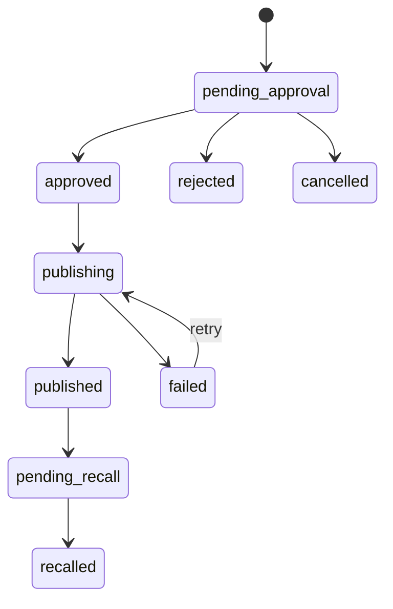

# 目标单体与多租户架构

## 目标

CampuxNext 应该是 TypeScript 全栈单体应用，同时内建多租户能力。这里的“单体”不是把所有代码写在一起，而是一个部署单元内按模块组织：

- Web UI、API、后台任务、Bot 适配器、发布器、渲染器共享同一套领域模型。
- 同一实例可管理多个学校/校园墙。
- 每个租户拥有自己的品牌、投稿规则、审核群、一个或多个 QQ 墙号、发布目标、OAuth 应用和运营配置。
- 运维上减少多套 Docker Compose、多份 Redis、多份配置文件带来的重复劳动。

## 建议技术形态

推荐使用 TypeScript monorepo，但运行时保持单体：

```text
CampuxNext/
  apps/
    web/              # Vite + React 前端 UI
    server/           # API、后台任务、Bot runtime
  packages/
    domain/           # 领域类型、状态机、权限策略
    db/               # Prisma schema、迁移、repositories
    integrations/     # OneBot、QZone、对象存储、OAuth provider
    render/           # Playwright 渲染
    config/           # 配置加载、租户设置 schema
```

技术栈决策：

- 前端构建：Vite + React。
- UI 组件：shadcn/ui，按移动端优先的校园墙体验组合组件，不照搬桌面后台 Sidebar 模式。
- 包管理器与脚本运行：Bun。
- 数据库：PostgreSQL。
- 后端：TypeScript server 入口，建议 Fastify 或 NestJS；Bot 常驻连接、发布队列和 Playwright 渲染更像后端服务，不建议用纯 Next.js 承担全部运行时。
- ORM：Prisma 或 Drizzle。若更看重 schema 可读性和迁移体验，用 Prisma；若更看重 SQL 控制和轻量，用 Drizzle。

数据库建议：

- 主库：PostgreSQL。
- 队列：当前阶段不引入 Redis，使用进程内内存队列调度后台任务。
- 对象存储：使用 S3 兼容接口。开发和自部署可以用 MinIO，但应用层只面向 S3 API。

内存队列只负责“现在要执行什么”，不要作为唯一事实来源。发布目标、发布尝试、失败原因、投稿聚合状态仍然写入 PostgreSQL。进程重启后，worker 应从 PostgreSQL 扫描 `publishing`、`failed but retryable`、`pending notification` 等状态并重新入队。

## UI 设计方向

CampuxNext 面向校园墙运营和学生投稿，不应该做成过于灰冷的通用后台。用户侧应以移动端优先设计，界面可以更生动一些，多一些色彩和校园感；管理能力应作为用户侧任务流的一部分进入，而不是默认呈现成桌面后台。

建议方向：

- 前台投稿页是默认首屏，使用鲜明品牌色、轻快状态表达、柔和但不单调的色块。
- 用户侧移动端主导航采用底部 Tab：投稿、稿件、服务、管理；桌面宽屏可以参考旧版增加简易左侧 Sidebar，但保持朴素入口，不做通用后台壳。
- shadcn/ui 用于 Card、Tabs、Select、Textarea、Badge、Switch、Alert、Avatar、Drawer、Dropdown Menu 等基础组件，保持一致的交互和可访问性。
- 管理页面可以在导航、状态标签、当前校园墙配置、发布目标状态上使用更丰富的颜色编码。
- 多租户场景下，每个学校可以拥有独立主题色、logo、墙名称和投稿规则展示。
- 不做纯营销式落地页，首屏仍以投稿、稿件状态、服务入口这些真实任务为核心。
- 状态表达要有温度：待审核、发布中、部分墙号失败、已同步发布等状态应一眼可分辨。

## 多租户模型

### 核心实体

多租户的关键是把“墙/学校”抽象为 `Tenant`，并让所有业务数据显式归属租户。



建议的基础表：

| 表 | 说明 |
| --- | --- |
| `tenants` | 学校/校园墙，含 slug、名称、状态、默认域名或访问路径 |
| `users` | 全局用户，以 QQ uin 或其他登录身份为主体；系统运维权限挂在用户账户上 |
| `tenant_memberships` | 用户被授权进入某租户的关系，以及在该租户下的角色，替代当前全局 `user_group` |
| `tenant_metadata` | 租户级站点配置，替代全局 `metadata` |
| `posts` | 投稿，增加 `tenant_id` |
| `post_logs` | 投稿日志，增加 `tenant_id` |
| `post_verbose` | 发布结果详情，增加 `tenant_id` |
| `ban_records` | 租户级封禁，增加 `tenant_id` |
| `oauth_apps` | 租户级 OAuth 应用，增加 `tenant_id` |
| `bot_accounts` | QQ 墙号、登录会话、命令入口配置 |
| `bot_sessions` | QZone cookies、登录状态、过期信息，加密存储 |
| `publish_targets` | 发布目标；同一租户可绑定多个 QZone 墙号并同步发布相同内容 |
| `publish_attempts` | 单篇投稿在单个发布目标上的发布记录、重试次数和结果 |
| `runtime_jobs` | 进程内任务类型，不一定落表；由 PostgreSQL 中的业务状态恢复 |

### 租户隔离策略

建议采用共享数据库、每张业务表带 `tenant_id` 的模式。它最适合“不是 SaaS，但一个实例管理多个学校”的目标。

必须落实的约束：

- 所有租户级表都带 `tenant_id`。
- 查询 repository 默认要求传入 `tenantId`，不要允许业务层裸查全表。
- 唯一索引必须考虑租户维度，例如 `(tenant_id, post_id)`、`(tenant_id, key)`、`(tenant_id, client_id)`。
- `uin` 不应再直接等于账号主键。一个 QQ 用户只有一个全局账户，但可以被授权进入多个学校，并在不同学校有不同角色和封禁状态。
- 不能默认允许一个账户进入所有租户。用户只有在 Bot 注册或后台授权后，才拥有对应校园墙的 `TenantMembership`。
- 权限模型分成两层：全局账户角色和租户内成员角色。

全局账户角色：

| 角色 | 作用域 | 权限 |
| --- | --- | --- |
| `system_operator` | 全局账户 | 进入运维面板，创建、停用和修改所有校园墙，管理所有用户、墙号、发布目标、系统配置和运维状态 |

租户内成员角色：

| 角色 | 作用域 | 权限 |
| --- | --- | --- |
| `submitter` | 单校园墙 | 投稿、查看和撤回自己的稿件、维护自己的账号信息 |
| `reviewer` | 单校园墙 | 查看待审核稿件、通过、拒绝、填写审核备注 |
| `admin` | 单校园墙 | 拥有审核能力，并可修改自己校园墙允许开放的配置，例如公告、投稿规则、服务入口、运营成员、发布目标展示名 |

现有 `user` 可以映射为 `submitter`，现有 `member` 可以映射为 `reviewer`，现有 `admin` 在单墙部署里可以先映射为租户内 `admin`。只有负责整个实例运维的人才应有账户级 `system_operator`。

租户内 `admin` 不是跨租户管理员。它只能读写自己所属校园墙下的数据。`system_operator` 才能跨校园墙查看和修改所有租户信息。

登录后租户选择规则：

1. 如果账户没有任何 `TenantMembership`，显示“暂无可访问的校园墙”，不允许进入普通用户页面。
2. 如果账户只有一个 `TenantMembership`，直接进入该校园墙。
3. 如果账户有多个 `TenantMembership`，先让用户选择要进入的校园墙。
4. 如果账户有 `system_operator` 权限，额外展示“系统运维面板”入口。这个入口和普通校园墙入口分开，不要混成普通租户切换器。

## 租户识别

Web 访问需要先定位租户。建议同时支持三种方式：

1. 域名：`gz.example.com` 解析到某租户。
2. 路径：`/t/:tenantSlug`。
3. 系统运维后台显式选择校园墙。

API 层建议使用以下上下文：

```ts
type RequestContext = {
  tenantId?: string
  userId?: string
  membership?: TenantMembership
  tenantRole?: "submitter" | "reviewer" | "admin"
  systemRole?: "system_operator"
}
```

前台投稿页必须有 `tenantId`，但不要把租户概念暴露给普通用户；它应表现为“当前校园墙”。系统运维后台可以没有默认校园墙，进入某个校园墙管理后必须绑定。

## 投稿与发布任务

现有 Redis Stream 语义可以映射为内存队列任务：

| 现有事件 | 新任务类型 | 触发 |
| --- | --- | --- |
| `new_post` | `notifyNewPost` | 投稿创建成功 |
| `post_cancel` | `notifyPostCancelled` | 用户取消 |
| `post_review` | `notifyReviewResult` | 审核通过/拒绝 |
| `publish_post` | `publishPost` | 审核通过后创建，或定时扫描创建 |

新系统第一阶段不引入 Redis。内存队列的可靠性通过 PostgreSQL 状态兜底：任务执行前写入或更新 `publish_attempts`，任务失败写入失败原因和下次重试时间，worker 周期性扫描需要补偿的记录并重新入队。

建议将发布流程改为显式任务状态：



这里建议把当前的 `in_queue` 重命名或语义收敛为 `publishing`。如果为了迁移兼容可以保留数据库枚举值 `in_queue`，但领域层暴露 `publishing`。

多租户下，发布任务必须包含：

- `tenantId`
- `postId`
- `targetId`
- `botAccountId`
- `attempt`
- `status`
- `lastError`

这样一个租户可以配置多个墙号或多个发布目标，不再依赖全局 `service.bots`。

### 单租户多 QQ 墙号同步发布

必须显式支持“一个学校有多个 QQ 墙号，同一篇投稿同步发布到多个 QQ 空间”的场景。原因是 QQ 单号好友上限约束会让大型学校自然拆成多个墙号，但运营侧仍希望它们表现为同一个校园墙。

推荐模型：

- `bot_accounts` 表示可登录、可收发消息、可发布 QZone 的 QQ 账号。
- `publish_targets` 表示某租户启用的发布目标，当前类型先支持 `qzone`，并绑定一个 `bot_account_id`。
- `publish_attempts` 表示一篇投稿对某个 `publish_target` 的一次或多次发布尝试。
- 投稿审核通过后，为该租户所有启用的发布目标生成 fan-out 任务。
- 只有所有 required 发布目标都成功后，投稿聚合状态才进入 `published`。
- 如果部分目标失败，投稿保持 `publishing` 或进入 `partially_failed`/`failed`，后台必须能看到每个墙号的独立失败原因并单独重试。

建议增加发布目标策略：

| 字段 | 说明 |
| --- | --- |
| `required` | 是否计入整篇投稿的发布成功判定；默认 true |
| `enabled` | 是否启用该目标 |
| `display_name` | 后台展示名称，例如“南校区墙号 1” |
| `bot_account_id` | 绑定的 QQ 墙号 |
| `publish_delay_seconds` | 该目标独立的发布延迟，可用于错峰 |
| `failure_policy` | 失败时阻塞整篇投稿，还是仅标记目标失败 |

这套模型比现有 Redis Hash 更清楚。当前 `service.bots` 已经隐含了“多个 Bot 都要发布完成才算 published”的思路，但它是全局配置，不能表达每个学校自己的多个墙号、每个墙号的启停、失败重试和可选目标。

## Bot 集成目标形态

当前 Bot 的业务逻辑建议迁入 `integrations/onebot` 和 `integrations/qzone`：

- OneBot 连接管理：接入一个或多个 QQ 机器人协议端。
- 命令路由：根据群号、私聊用户、Bot 账号定位租户。
- 审核群通知：租户级配置。
- 私聊注册和重置密码：需要先判断用户要注册哪个租户。可以通过 Bot 账号所属租户或命令参数决定。
- QZone 发布器：租户级 Bot 账号和 session，同一租户可启动多个账号的发布 worker。

命令路由要从“一个 Bot 只有一个租户”升级为：

```text
message -> botAccountUin -> tenantBotBinding -> tenantId -> command handler
groupId -> tenant review group binding -> tenantId
```

如果一个 QQ Bot 账号服务多个学校，需要进一步支持命令参数或群绑定。但从当前运营模式看，更自然的是一个学校绑定一个审核群，并允许该学校配置多个墙号用于同步发布。

## 渲染服务目标形态

Utility 可以变成内部渲染模块：

- 模板存储在数据库或代码模板目录。
- 模板变量来自 `tenant_metadata`、`post`、`user`、`bot_account`。
- Playwright 浏览器实例复用，渲染结果写入 S3 对象存储；本地临时目录只用于渲染过程中的短生命周期中间文件。
- 对模板执行白名单或使用安全模板引擎，避免当前 Bot 中 `eval(post_publish_text)` 这类动态执行。

当前 `post_publish_text` 支持表达式拼接，这很灵活但风险高。建议改为模板字符串，例如：

```text
#{post.id}
{links}
投稿来自 {tenant.name}
```

由代码提供 `post`、`tenant`、`links` 等安全变量。

## API 兼容策略

为了降低前端和 Bot 迁移成本，可以先保留 `/v1` 风格，但新接口必须显式带租户：

- 公共页面：`GET /api/tenants/by-host`
- Metadata：`GET /api/tenants/:tenantId/metadata`
- 投稿：`POST /api/tenants/:tenantId/posts`
- 后台：`GET /api/admin/tenants`
- Bot 内部：不再经 HTTP 调本机 API，改为调用 domain service。

若保留旧 `/v1`，应仅作为单租户兼容层：当实例只有一个租户时自动映射，或通过配置指定默认租户。

## 配置归属

需要从全局配置迁入数据库的配置：

- `brand`
- `banner`
- `popup_announcement`
- `post_rules`
- `services`
- `beianhao`
- `service.bots`
- `service.domain`
- `campux_review_qq_group_id`
- `campux_qq_bot_uin`
- `campux_help_message`
- `campux_review_help_message`
- `campux_publish_post_time_delay`
- `campux_qzone_cookies_refresh_strategy`
- `post_publish_text`

仍适合作为实例级环境变量的配置：

- 数据库连接。
- S3 endpoint、bucket、region、access key、secret key、public base URL。
- 加密密钥。
- Web 监听端口。
- OneBot 连接默认参数。
- Playwright 浏览器路径或运行参数。

## 安全要点

- Bot cookies 必须加密落库，不能像现在一样以 JSON 明文缓存。
- OAuth2 app 必须按租户隔离，redirect URI 校验继续保留严格匹配。
- Service token 在单体内应消失。若还存在外部 Bot 兼容模式，也要变成租户级 token，并支持轮换。
- 投稿图片对象 key 应包含租户前缀，例如 `tenants/{tenantId}/posts/{postId}/...`。
- 所有后台任务执行前重新加载校园墙配置，避免配置变更后旧任务误发。
