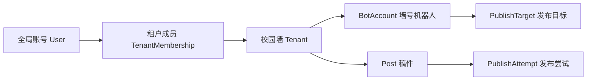

# 系统模型

Campux 的核心模型是“一个全局账号，可以被授权进入多个校园墙”。

## 角色层级

| 层级 | 角色 | 说明 |
| --- | --- | --- |
| 全局 | 系统运维 | 可进入独立运维面板，管理所有租户、全局用户、权限和审计 |
| 租户 | 管理员 | 管理当前校园墙的成员、封禁、机器人、发布目标和元数据 |
| 租户 | 审核员 | 审核当前校园墙的稿件，查看统计 |
| 租户 | 用户 | 投稿、查看自己的稿件、撤回审核中的稿件 |

## 登录与租户选择

登录后系统会按下面规则进入页面：

1. 如果账号只有一个校园墙成员身份，直接进入该校园墙。
2. 如果账号有多个校园墙成员身份，进入校园墙选择页。
3. 如果账号是系统运维，会额外显示“进入运维面板”。
4. 如果访问域名绑定了某个校园墙 host，则账号会被锁定到该校园墙，不再展示租户选择。

## Bot 与发布目标

一个校园墙可以有多个机器人，一个机器人可以对应多个发布目标。Campux 通过 `bot_id + token` 识别 OneBot 协议端连接，不依赖 QQ 号猜测租户。

发布目标负责描述“这条稿件要发到哪里”，并保存：

- 所属机器人
- 是否必发
- 风控间隔
- cookies 刷新方式
- 文案模板
- 发布状态和最近错误
