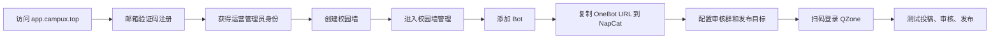

# 自助开墙流程

这篇文档描述官方服务 `app.campux.top` 预期的完整自助链路：墙号运营者访问管理端，注册运营管理员账号，创建自己的校园墙，接入 NapCat，然后开始收稿、审核和发布。

产品内也会在登录页、运营面板、机器人页和发布页展示同样的步骤。文档用于部署前检查和排查问题，不应该成为运营者完成流程的唯一入口。

## 角色体验边界

Campux 里同时存在多类用户，产品内引导必须按角色分层，避免普通用户看到平台运维概念。

| 角色 | 进入方式 | 看到的引导 | 不应该看到 |
| --- | --- | --- | --- |
| 普通用户 | 通过校园墙机器人注册或管理员添加 | 投稿规则、修改密码、自己的稿件状态 | 自助开墙、Bot、发布目标、全局租户 |
| 审核员 | 被管理员授权到某个校园墙 | 审核流程、筛选、通过/拒绝、统计 | 租户生命周期、运营管理员授权 |
| 校园墙管理员 | 被授权为某个校园墙管理员 | Bot、发布目标、成员、封禁、元数据、统计 | 全局用户、其他校园墙 |
| 运营管理员 | 从管理端 host 注册或由系统运维授权 | 创建/管理自己负责的校园墙，进入墙内管理 | 系统级安全配置、所有租户 |
| 系统运维 | 预置或手动授权 | 管理端 host、租户生命周期、全局用户、运营管理员资源 | 面向普通用户的投稿引导 |

登录页的“注册”只面向墙号运营者。普通用户如果没有账号，应通过对应校园墙机器人注册，而不是在管理端创建运营管理员账号。

## 总流程



## 1. 打开管理端并注册

系统运维需要先在运维面板配置“管理端 host”，例如：

```text
app.campux.top
```

用户从这个 host 访问登录页时，页面会显示“第一次使用 Campux？”入口。点击注册后填写：

- 邮箱。
- 邮箱验证码。
- 账户名称。
- 密码。

注册成功后，账号会直接获得“运营管理员”身份，并进入运营管理面板。

> 如果登录页没有注册入口，先检查当前访问域名是否等于运维面板里的管理端 host。

## 2. 创建校园墙

在运营管理面板填写：

| 字段 | 建议 |
| --- | --- |
| 校园墙名称 | 面向运营者和用户展示的名称 |
| slug | 访问标识，例如 `gzhu-wall`。要求 4-16 个字符，只能使用小写字母、数字和连字符，且不能以连字符开头或结尾。官方服务会用它生成专属子域名，例如 `gzhu-wall.campux.top`；创建后不可修改 |
| 专属 host | 可选，例如 `wall.example.com`。留空时官方服务自动使用 slug 子域名 |
| 主题色 | 用于页面和渲染图的品牌色 |
| Bot QQ | 可选，填写后会同时创建一个 Bot 和发布目标 |

创建后，当前运营管理员会自动成为该校园墙的管理员。刷新登录态后，页面顶部会出现“选择校园墙”入口；进入该校园墙后继续配置机器人和发布目标。

当账号有多个校园墙身份时，登录后会先进入校园墙选择页；运营管理员还能在这里看到“进入运维面板”入口。


## 3. 添加 Bot 并连接 NapCat

进入“管理 / 机器人”，添加 Bot：

- Bot QQ：NapCat 登录的 QQ 号。
- 显示名：后台展示名称，例如“1 号墙”。
- 审核群号：接收新稿件、通过、拒绝、重发、登录提醒和发布异常通知的群。

创建后，每个机器人卡片都会显示独立的 OneBot 连接 URL：

```text
wss://app.campux.top/onebot/v11/ws?bot_id=<bot-id>&token=<connection-token>
```

在 NapCat 中添加反向 WebSocket 客户端，把完整 URL 粘贴进去。协议端登录的 QQ 必须与 Bot QQ 一致，否则 Campux 会拒绝这条连接。

连接成功后，机器人卡片会显示在线状态、连接数和最近心跳。


## 4. 审核群命令边界

审核群里的命令只在 Bot 配置的审核群内生效。其他群即使出现类似命令，Campux 也会静默忽略，不会回复报错或提示。

审核群常用命令：

```text
#通过 <稿件编号>
#拒绝 <理由> <稿件编号>
#重发 <稿件编号>
#登录
#扫码登录
```

也可以先 at 墙号再写命令。编号会在审核群消息里单独成行，方便复制。

## 5. 配置发布目标与 QZone 登录

进入“管理 / 发布”，创建发布目标：

- 选择负责发布的 Bot。
- 填写目标名称。
- 设置风控间隔，默认建议 10 秒或更高。
- 选择是否为必需发布目标。
- 选择 cookies 刷新方式。

Campux 支持两种登录方式：

1. **扫码登录**：推荐模式。网页或审核群启动扫码，运营者用 QQ 扫码后保存 QZone cookies。
2. **协议自动获取**：依赖协议端支持获取 QZone cookies；不支持时会失败。

创建发布目标后，点击“重新登录”或在审核群发送 `#扫码登录`。登录完成后点击“检测 cookies”，确认状态为可用。

发布目标、cookies 状态和最近发布日志都在“管理 / 发布”同一页处理：


## 6. 测试一条完整投稿

上线前至少跑一遍：

1. 用普通用户账号登录或通过机器人注册。
2. 在“投稿”页提交文字和图片。
3. 确认审核群收到新稿件消息。
4. 在网页审核页或审核群通过稿件。
5. 展开“管理 / 发布”里的发布日志，确认每个发布目标状态和 HTTP 返回。
6. 在 QQ 空间确认内容真实发布。

普通用户看到的投稿页是这样的，顶部公告、文字框、图片上传、匿名开关和投稿规则一目了然：


如果显示已发布但空间没有内容，优先看发布日志里的 HTTP 明细；如果 cookies 失效，系统会在审核群提醒重新登录。

## 运营者上线检查表

- 登录页能看到注册入口。
- 邮箱验证码可以收到。
- 创建校园墙后账号自动成为管理员。
- 机器人页能复制 OneBot URL。
- NapCat 连接后机器人显示在线。
- 审核群能收到新稿件消息。
- 审核群非命令 at 会显示可编辑的命令提示。
- 其他群里的命令会被静默忽略。
- 发布目标 cookies 状态可用。
- 风控间隔符合墙号风险控制要求。
- 投稿规则、公告、服务入口和封禁策略已配置。

## 系统维护者检查表

- `CAMPUX_WEB_ORIGIN` 指向对外访问域名。
- 运维面板里的管理端 host 已设置为 `app.campux.top`。
- 如需自动分配专属子域名，已配置 `CAMPUX_TENANT_DOMAIN_SUFFIX` 和 `CAMPUX_CLOUDFLARE_API_TOKEN`。
- Resend 邮件配置可用，注册验证码能发送。
- 反向代理支持 WebSocket upgrade。
- `CAMPUX_BOT_SESSION_SECRET` 已在生产环境设置。
- 对象存储的公开访问地址可被浏览器和协议端访问。
- 数据库 migration 在启动时自动执行，或部署流程中显式执行。
