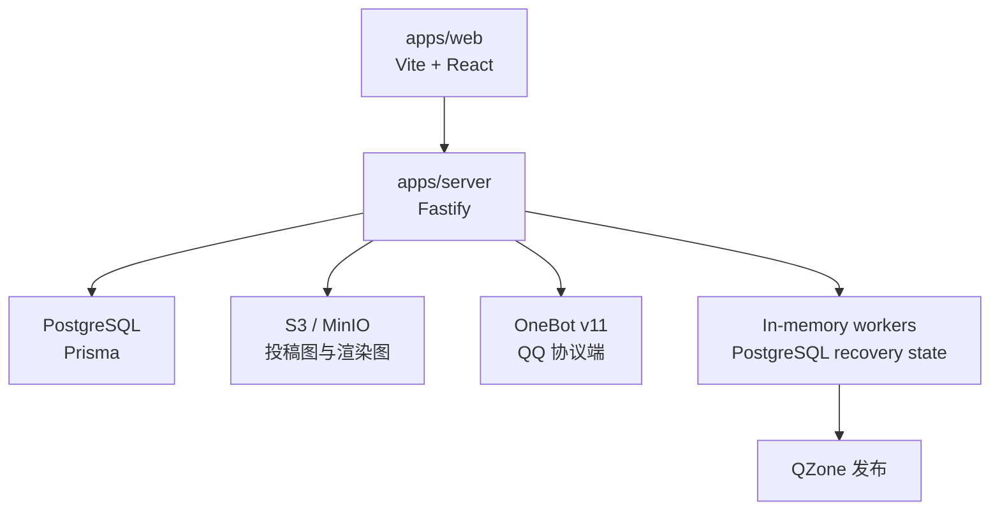

# 系统架构

Campux 是 TypeScript monorepo：

## 目录

| 目录 | 说明 |
| --- | --- |
| `apps/web` | Web 前端 |
| `apps/server` | API、静态资源、OneBot WebSocket、后台 worker |
| `packages/db` | Prisma schema、migration、seed、密码工具 |
| `packages/config` | 环境配置读取 |
| `packages/domain` | 跨端共享领域类型 |
| `packages/integrations` | S3、QZone 等集成 |
| `packages/render` | 稿件渲染图生成 |
| `docs` | VitePress 文档站 |
| `legacy` | 旧版 Campux 代码归档 |

## 后台队列

Campux 当前保持单实例设计，不引入 Redis。运行时队列在内存中，但发布尝试状态落在数据库里。

worker 处理发布任务前会用条件更新把状态从可执行状态转为 `running`。如果另一个 worker 已抢到同一个任务，本次执行会跳过，避免同一个发布目标重复发布。

## 数据边界

- `Tenant`：校园墙。
- `User`：全局账号。
- `TenantMembership`：账号进入某个校园墙的身份。
- `BotAccount`：租户内机器人。
- `PublishTarget`：发布目标。
- `Post`：稿件。
- `PublishAttempt`：某稿件到某目标的一次发布任务。
- `AuditLog`：管理操作审计。

## 静态资源

生产模式下，Fastify 会从 `CAMPUX_WEB_DIST_DIR` 提供前端静态资源。非 `/api` 和非 `/onebot` 的 GET 请求会回退到前端路由。
