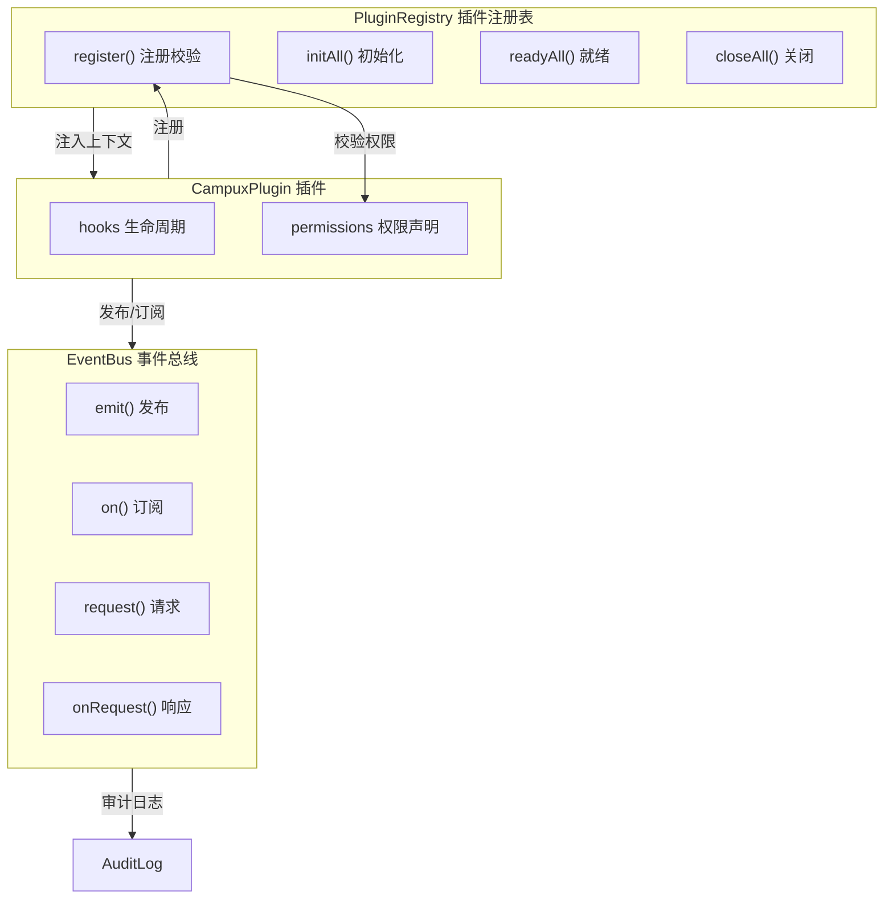

# 插件系统

Campux 插件系统允许通过插件扩展校园墙的功能，同时通过权限声明、审计日志和生命周期管理确保安全可控。

## 设计目标

- **安全可控**：每个插件必须声明所需权限，注册时校验，高风险权限产生警告
- **可观测**：所有插件操作（注册、状态变更、权限检查、请求/响应）均记录审计日志
- **生命周期管理**：插件通过 `onInit` → `onReady` → `onClose` 钩子参与服务生命周期
- **松耦合通信**：插件间通过事件总线（发布/订阅）和标准化请求/响应进行通信

## 架构概览



## 核心概念

### 插件（CampuxPlugin）

插件是一个实现 `CampuxPlugin` 接口的对象，包含：

| 字段 | 类型 | 必填 | 说明 |
| --- | --- | --- | --- |
| `name` | `string` | 是 | 唯一名称，如 `"campux-plugin-qzone"` |
| `version` | `string` | 是 | 语义化版本 |
| `description` | `string` | 否 | 插件描述 |
| `hooks` | `PluginHooks` | 否 | 生命周期钩子 |
| `permissions` | `PluginPermissions` | 否 | 权限声明 |
| `campuxVersion` | `string` | 否 | 兼容的 Campux 版本范围 |
| `enabledByDefault` | `boolean` | 否 | 是否默认启用（默认 `true`） |

### 权限系统

插件通过 `permissions` 字段声明所需权限。注册时校验：未知权限会拒绝注册，高风险权限会产生警告日志。

**可用权限：**

| 权限 | 风险 | 说明 |
| --- | --- | --- |
| `config:read` | 低 | 读取全局配置 |
| `events:emit` | 低 | 发布事件 |
| `events:listen` | 低 | 订阅事件 |
| `db:read` | 中 | 读取数据库 |
| `tenant:data` | 中 | 访问租户数据 |
| `queue:worker` | 中 | 注册后台 worker |
| `db:write` | 高 | 写入数据库 |
| `http:route` | 高 | 注册 HTTP 路由 |
| `user:data` | 高 | 访问用户数据 |

### 生命周期

```
register() → initAll() → [注册路由] → readyAll() → [服务运行] → closeAll()
                │                         │                        │
                ▼                         ▼                        ▼
            onInit()                   onReady()               onClose()
```

- **onInit**：服务启动时调用，路由注册前。适合初始化连接、订阅事件。
- **onReady**：所有路由注册完成后调用。适合发布就绪事件、启动后台任务。
- **onClose**：服务关闭时调用。适合清理资源、关闭连接。

### 事件总线 (EventBus)

插件间通过事件总线进行松耦合通信：

- **发布/订阅**：`events.emit(event)` 发布事件，`events.on(type, handler)` 订阅事件
- **通配符**：`events.on("*", handler)` 订阅所有事件
- **请求/响应**：`events.request(req)` 发送请求，`events.onRequest(action, handler)` 注册处理器
- **异步发布**：`events.emitAsync(event)` 等待所有 handler 完成

**内置事件类型：**

| 事件 | 触发时机 |
| --- | --- |
| `post:created` | 新投稿创建 |
| `post:status_changed` | 投稿状态变更 |
| `post:published` | 投稿发布成功 |
| `post:recalled` | 投稿撤回 |
| `review:approved` | 审核通过 |
| `review:rejected` | 审核拒绝 |
| `tenant:created` | 校园墙创建 |
| `tenant:activated` | 校园墙激活 |
| `tenant:paused` | 校园墙暂停 |
| `tenant:archived` | 校园墙归档 |
| `user:registered` | 用户注册 |
| `user:joined_tenant` | 用户加入校园墙 |
| `bot:message_received` | 机器人收到消息 |
| `publish:attempted` | 发布尝试完成 |

### 审计日志

所有插件操作自动记录审计日志，可通过 `registry.getAuditLog()` 或 `events.getAuditLog()` 查询。

**审计操作类型：**

| 操作 | 说明 |
| --- | --- |
| `plugin:registered` | 插件注册 |
| `plugin:status_changed` | 插件状态变更 |
| `plugin:permission_check` | 权限校验 |
| `plugin:request_sent` | 插件间请求发送 |
| `plugin:response_received` | 插件间响应接收 |
| `plugin:error` | 插件错误 |

## 插件上下文 (PluginContext)

插件通过 `PluginContext` 访问运行时资源：

```ts
interface PluginContext {
  app: FastifyInstance;   // Fastify 实例
  config: CampuxConfig;    // 全局配置
  db: PrismaClientType;    // 数据库客户端
  events: EventBus;        // 事件总线
  logger: PluginLogger;    // 带插件名前缀的日志器
  queue: PluginQueue;      // 后台队列
}
```

## 安全设计

1. **权限声明**：插件注册时必须声明所需权限，未知权限拒绝注册
2. **风险分级**：权限分为 low / medium / high 三级，高风险权限注册时产生警告
3. **审计追踪**：所有插件操作记录审计日志，包含时间戳、操作类型、插件名、详情
4. **状态管理**：插件可被管理员禁用/启用，禁用后 `initAll` / `readyAll` 跳过该插件
5. **错误隔离**：`onReady` 失败不中断其他插件，事件 handler 异常不中断其他 handler